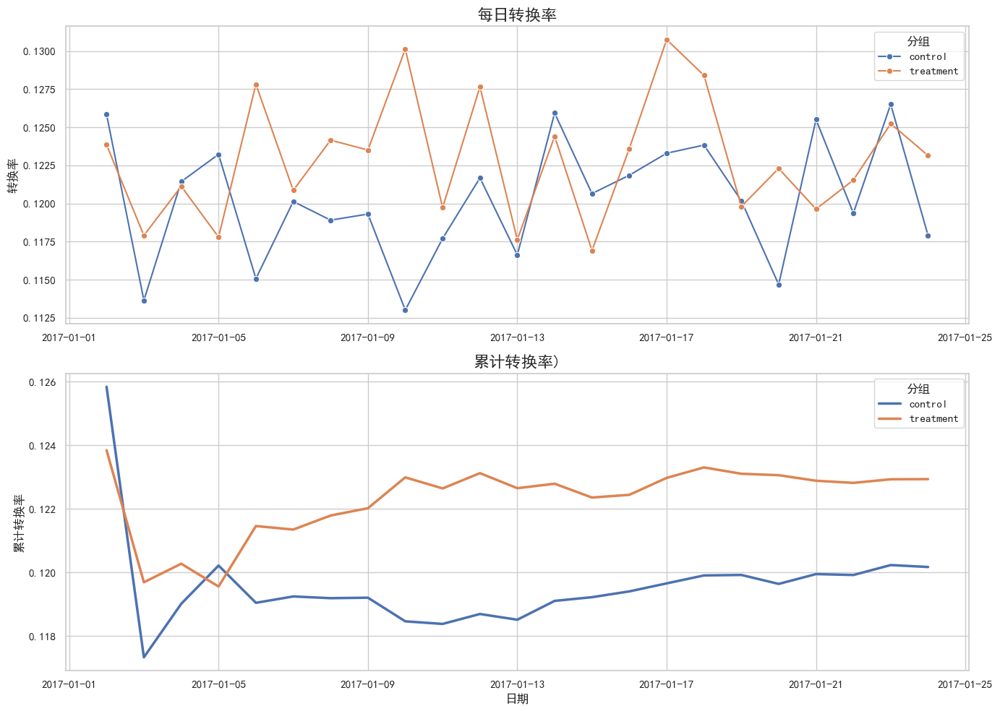

# -AB-
# 🚀 E-Commerce A/B Testing Analysis: Optimizing Conversion Rates

> **项目概述：** 本项目基于 **290,000+** 条用户行为日志，对电商网站新旧落地页（Landing Page）进行 A/B 测试评估。通过严格的统计学推断与时间序列分析，成功验证新版本带来了 **2.3% 的相对转化率提升**，并输出了全量上线的业务决策建议。

---

## 📊 核心成果 (Executive Summary)

经过严谨的假设检验与数据验证，实验取得了显著的正向收益：

| Metric (指标) | Control Group (Old) | Treatment Group (New) | 变化 (Delta) | 结果判定 |
| :--- | :--- | :--- | :--- | :--- |
| **转化率 (Conversion Rate)** | `12.02%` | `12.29%` | `+0.27%` (绝对值) | ✅ **Positive** |
| **相对提升 (Relative Lift)** | - | - | **`+2.3%`** | 🚀 **Growth** |
| **P-Value** | - | - | **`0.02`** | ⭐ **Significant** |

* **统计结论：** $P < 0.05$，拒绝原假设。新页面在 95% 置信水平下显著优于旧页面。
* **业务价值：** 若全站日均流量为 10万 UV，该改版预计每日带来额外 **270+** 转化订单。

---

## 🛠️ 分析方法与技术细节 (Methodology)

作为统计学背景的分析项目，本项目并未止步于简单的 T检验，而是构建了完整的实验评估框架：

### 1. 数据清洗与质量控制 (Quality Control)
* **去重处理：** 识别并移除了 3,893 条 `user_id` 与 `group` 不匹配的异常数据，确保样本满足**独立同分布 (IID)** 假设。
* **SRM 检验 (Sample Ratio Mismatch)：**
    * 使用 **卡方检验 (Chi-Square Test)** 验证流量分配的均匀性。
    * 结果：P-value > 0.01，确认分流系统无故障，排除了幸存者偏差对实验的干扰。

### 2. 统计推断 (Statistical Inference)
* **假设检验：** 采用 **双尾 Z-test (Two-tailed Z-test)** 对比两组转化率。
* **置信区间：** 计算差异的 95% 置信区间，确认下界大于 0，量化了最差情况下的正向收益。

### 3. 趋势稳定性分析 (Trend Analysis)
* 绘制 **累计转化率 (Cumulative Conversion Rate)** 曲线，通过时间维度监控数据收敛情况，有效排除了 **“新奇效应” (Novelty Effect)** 对早期数据的干扰。

---

## 📈 可视化分析 (Visualizations)

### 1. 累计转化率趋势图
下图展示了实验期间，新旧页面转化率的收敛过程。
*(注：请确保你的 images 文件夹中有这张图片，名称对应即可)*

**分析解读：**
* **分离趋势：** 实验组（橙线）在初期波动后，持续稳定在控制组（蓝线）上方。
* **稳定性：** 随着样本量增加（X轴推移），两条曲线趋于平滑且未发生交叉，证明 **2.3% 的提升** 并非短期波动，而是稳定的长期优势。

---

## 💡 商业决策建议 (Business Recommendation)

基于数据分析结果，我向业务部门提出以下建议：

1.  **立即全量发布 (Launch)**
    * 统计学证据强（P=0.02），且置信区间下界显示收益为正。
    * 新页面不仅提升了转化率，且在测试周期内未引发技术故障或用户反感。

2.  **预期收益测算 (Revenue Impact)**
    * 假设网站日均访问量 (UV) 为 **100,000**，平均客单价 (AOV) 为 **50**。
    * 转化率提升 **0.27%** 意味着每天额外增加 **270** 个订单。
    * **年化增收预估：**约 490 万)**。

